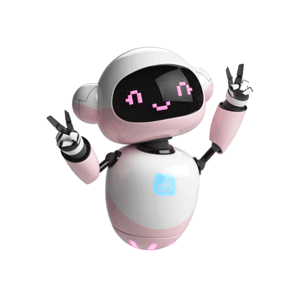

# Hi everyone, I'm Safoura! 🤗

I am currently exploring machine intelligence to push the boundaries of what's possible. I view LLMs and autonomous agents not just as tools, but as evolving intelligent entities.

- AI Engineer in the making 
- M.Sc. Artificial Intelligence @ University of Bologna

  

&nbsp;

&nbsp;

&nbsp;

<!--  -->

